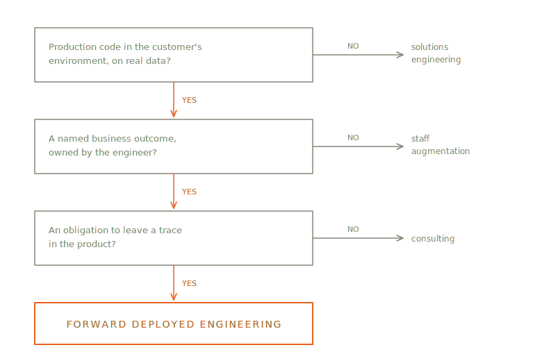

# 1. The Job

The text arrives at 6:10 on a Tuesday: the overnight feed from Meridian National Bank's servicing system has stopped loading, and the covenant alerts that ran clean for twelve days are now running on stale data. Advik reads it on the train into the city. By the time he badges into a building his employer does not own — week five of an eight-week engagement — his agent has already profiled the failure: a core-banking patch renamed a column in the nightly extract, eleven tables downstream. He reviews the patch the agent drafted, tightens the backfill himself, and has the pipeline green by 9:40. The timing matters less because the data is flowing again and more because the 10:00 standup includes an operations analyst who has been waiting for a reason to distrust the system.

At 11:00 that analyst — Janet, eleven years at the bank — shows him why her numbers and his disagree, and it is the most valuable half hour of the week. Her covenant spreadsheet carries a hand-maintained column for amendments: rate changes and waiver terms negotiated on paper, initialed by relationship managers, never keyed back into the servicing system. For sixty-one of the bank's twenty-four hundred middle-market loans, the spreadsheet is the system of record and the system of record is fiction. No requirements document mentioned this, because nobody who writes requirements documents knew.

At 2:00, a steering committee he expected to be routine turns into an ambush: a program manager wants the engagement to "pick up" a treasury dashboard while it's here, and two directors in the room think that sounds efficient. Advik says no the only way no works inside a customer — by reading from the Charter. One outcome, covenant monitoring on the middle-market book, exit date November 7th; the dashboard goes on record as evidence for a future engagement. He answers one technical question honestly and leaves the rest of the meeting to the colleague whose job the rest of the meeting is.

At 5:30 he writes the day down: a Ledger entry for the shortcut Janet's discovery forced — a hard-coded override table for the sixty-one amended loans, right for this engagement, wrong forever, logged with the trigger that will someday break it — and a note to the core team that the servicing system's amendment gap is the second one like it this year. Then he closes the laptop, because Thursday has a showcase in it.

There is a kind of engineer who works inside other people's companies. Not visiting — working. They have a badge for a building their employer doesn't own, credentials on a network their employer doesn't run, and a standing meeting with people who appear on no org chart they belong to. They ship production code into that environment, against that customer's real data, and they are paid by the software company whose product they carry with them.

The title, most often, is Forward Deployed Engineer. The name comes from the military: a forward-deployed unit is stationed in the theater, near the action, instead of at headquarters. The job comes from a simple observation that this book will spend several chapters defending: for a certain class of software, the distance between the vendor's headquarters and the customer's reality is where projects die, and the cheapest way to close that distance is to put an engineer on the other side of it.

## A week in the field

Advik's Tuesday is the job's texture. Its proportions show better at the scale of a week — the one that follows is assembled from documented accounts of the work and engagements like his, and any single week will bend around whatever is on fire. The proportions are the point.

Monday is data. Something in the customer's warehouse doesn't match what last week's showcase assumed — a claims feed changed format, or a table that was supposed to be authoritative turns out to be a copy someone stopped updating in March. You find this out not from a ticket but because you looked. An agent profiles the affected tables while you read the pipeline code; by afternoon you know whether this is an hour's patch or the week's real work.

Tuesday is building. The platform your company sells does most of what this customer needs; your job is the last mile — the connector their thirty-year-old policy system requires, the eval suite that proves the model's answers against their historical cases, the workflow screen their operations team will actually use. You work with agents the way the previous generation worked with IDEs: constantly and unremarkably. The volume of code produced would have taken a small team a month, a few years ago. Most of it is glue, and you are not sentimental about that, because the glue is where the outcome lives.

Wednesday there is a meeting that has nothing to do with engineering and everything to do with whether the engagement survives. A department head has realized your system touches their team's workflow. Your counterpart — the one who owns adoption and politics, the role this book calls the Field Strategist — has been expecting this for two weeks and knows what the department head needs to hear, and from whom. You attend, mostly to answer one technical question honestly. The meeting matters more than anything you will build this week.

Thursday is the Showcase. The customer's sponsor — the executive who owns the outcome — watches the system run against live data. The eval score is on screen next to the business number it drives. Two pieces of feedback would each consume a month; you take them, and by Friday's triage one is in next week's build, one is written down as evidence for a future engagement, and nobody was told a comfortable yes.

Friday you write. An entry in the engagement's Ledger recording the shortcut you took Tuesday and what it assumes. A note to the product team: that connector is the second one of its kind this quarter, and the platform should probably own it. This is the part of the week most likely to be skipped, and the part this method exists to protect — it is where a customer project quietly becomes product knowledge.

## The three neighbors

Every description of this job eventually collides with three adjacent trades, and the collisions are where the definition lives.

The first neighbor is the solutions engineer or solutions architect: pre-sales, demo-oriented, skilled at building the prototype that wins the deal. An honorable trade — and a different one. The solutions engineer's artifact runs on anonymized data in a sandbox and is finished when the contract signs. The forward deployed engineer's artifact runs on real data in production and is finished when the outcome lands.

The second neighbor is staff augmentation: an engineer rented to the customer, working the customer's backlog under the customer's direction. Also honorable, also different. The distinction is accountability. A staff-aug engineer owes the customer effort against a ticket queue. A forward deployed engineer owes them an outcome — a number the customer's executives track, named in writing before the work began.

The third neighbor is the one that stings: consulting. The consultant embeds, learns the domain, builds the bespoke system, bills the hours. From the customer's side of the table, week to week, the resemblance is real. The difference — chapter 3 takes the question seriously enough to give it a full chapter — is what happens to the work afterward. A consultant's learning walks out the door with the consultant. A forward deployed engineer's learning is owed to a product: extracted, generalized, folded into the platform so the next customer needs less field engineering than this one did.

Frontier compresses these three collisions into a test. Work is Forward Deployed Engineering only if all three of these hold: **production code in the customer's environment, against real data** — not offline prototypes, not sandboxes. **Ownership of a named business outcome** — not a deliverables list, not a satisfaction score. **An obligation to leave a trace in the product** — extraction as a duty, not a bonus. This book calls it the FDE test, and it does its best work not in definitional arguments but inside companies: it is how a team, or the engineer deciding whether to take the job, checks what a role actually is regardless of what the posting called it.

## Why this job, now

The role is two decades old — chapter 2 tells that history — but it was a niche practice until roughly 2023, and then it wasn't. Job postings for forward deployed engineers grew several hundred percent year over year; the AI labs built field teams; so did most of the companies selling AI systems into enterprises.

The reason is in the nature of what is being sold. Probabilistic systems demo brilliantly and deploy stubbornly. A model that performs on curated examples must still be made to perform on this customer's data, inside this customer's systems, at a reliability their operations can live with — and that tuning cannot be done from headquarters, because the thing being tuned against exists only at the customer. At the same time, the economics of field engineering changed from the builder's side: an engineer working with AI agents produces what a small team used to, which means the intense, expensive, one-customer attention this model demands stopped requiring a small team. The job sits exactly at the intersection: engineers who build AI systems, with AI systems, in the one place the systems can be made real.

That intersection is where this book's method lives. Forward Deployed Engineering is the discipline — anyone doing work that passes the FDE test is doing it, method or no method. Frontier is one opinionated way to do it well: a time-boxed engagement with an exit date, a weekly loop of working software shown to the outcome's owner, a written record that turns field shortcuts into product signal, and four metrics that tell you whether any of it is working. The rest of Part I is the argument for why. Part II is the method itself. Part III is for the people who fund it, staff it, and host it.

The place to start is where the job started: with a company whose customers could not be served any other way.
