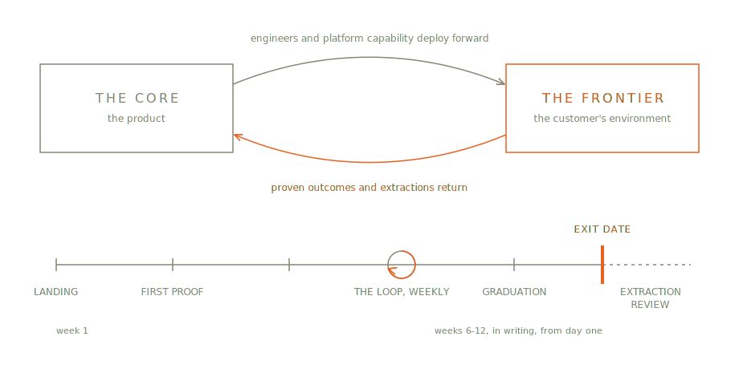

# 5. The Method at Altitude

Forward Deployed Engineering is a discipline: the practice of embedding product engineers inside a customer's environment to ship working software against real data, own a named outcome, and feed what they learn back into the product. Frontier is one opinionated way to run that discipline — as Scrum is one way to run agile development, and as a particular training program is one way to run a sport. You can do FDE without Frontier. Plenty of good teams do, by instinct and local invention. What they cannot do without something like Frontier is tell, from the outside or even the inside, whether they are doing it well — instinct doesn't audit.

This chapter is the method seen from altitude: what its values decide, why its principles are the ones they are, what the diagram looks like on a whiteboard, and what Frontier refuses to be. Everything here is expanded, one chapter per element, in the part that follows.

## Five values, built for conflict

Frontier's values come in contrastive pairs — outcomes over deliverables, production over demos, firsthand context over written requirements, the product over the project, exits over residencies — and the form is doing work. A value stated alone ("we value quality") costs nothing and decides nothing. A value stated against a respectable alternative tells you what to do on the day the two collide, and the collisions are the job.

Each pair marks a real fork that field teams face weekly. A sponsor asks for the deliverables list; the Charter names an outcome instead — that is the first pair, live. A demo on staged data would land better than the honest eval score — the second. The account team's briefing contradicts what the data shows — the third. The customer would happily pay to keep you building customer-specific features forever — the fourth. The engagement is going so well nobody wants it to end — the fifth, and the most seductive, because it fails while everyone is smiling.

The right-hand items are not straw men. Deliverables, demos, requirements, projects, and long residencies all have honest uses, which is exactly why they win by default when no one has decided otherwise in advance. The values are the advance decision.

## Eleven principles, and why these

The manifesto states the principles; this section explains their selection. They fall into natural groups.

The first three locate the work. Go where the context is — the founding argument, chapter 4's first claim made imperative. Start in the data, not the requirements — the same argument applied to week one, because the briefing is compressed and the data is not. Deploy the platform; build the last mile — the principle that separates this discipline from bespoke development, and the oldest one in the set: Palantir conceived the role to land its platform quickly inside customers who couldn't land it themselves. Field work that starts from an empty repo isn't forward deployment; it's a body shop with better branding.

The next two set the tempo. Ship something real inside two weeks and show, discuss, ship again are both consequences of the time-box: with six to twelve weeks and a customer's attention decaying weekly, the engagement can afford neither a long runway nor a slow loop. Both principles carry their AI-era calibration on their face — two weeks is generous when most of the proof is platform assembly plus agent-assisted glue, and "working," for a probabilistic system, means an eval score rather than an anecdote.

Two more govern the relationship between edge and core. Overfit at the edge, generalize at the core licenses the field to solve this customer exactly — a license consultants take silently and product engineers refuse guiltily, both wrongly. Every engagement feeds the product is the license's price tag, and the flywheel rides on it: each extraction widens the platform, each widening shortens the next engagement.

Two keep engagements honest. Own the outcome, not the ticket names the accountability that separates an FDE from a staff-augmentation contractor. Set the exit date on day one is the method's most-quoted line for a reason — an engagement without an exit date is a services contract discovering itself, and no one involved will notice the discovery until renewal.

The last two are about people. Adoption is half the job — staff it exists because the record is unambiguous: engagements fail on workflow change and institutional politics more often than on engineering, and teams that treat that half as everyone's implicit duty have staffed it with no one. Nobody lives at the frontier is the rotation principle, and it earns its place in the normative core because burnout in this role is structural, not personal — the travel, the context-switching, and the outcome pressure are features of the job, so the recovery must be a feature of the method.

Eleven is not a round number, and that is fine. The set is closed by argument, not by symmetry: each principle answers a documented failure mode, and none is decoration.

## The diagram

On a whiteboard, Frontier is one loop and one timeline.

The loop runs between two poles. On the left, the Core: the product, its platform, its engineers. On the right, the Frontier: the customer's environment, real data, real users. The rightward arrow carries the platform and the engineers forward into the engagement. The leftward arrow carries back the two things the field produces: a proven outcome and the Ledger's extractions. Drawn honestly, the arrows are a cycle, not a delivery — the same engineers rotate along them, the same platform returns wider than it left.

Beneath the loop, the engagement timeline: Landing, First Proof, the Loop circling through its weekly Showcases, Graduation, the Extraction Review — with the exit date drawn as a hard right edge, because that is what it is. Thirty seconds, two arrows, five phases. If a team's version of the diagram needs a legend, something has been added that should not have been.

## What Frontier refuses to be

A method is defined as much by its refusals as its rules, and Frontier makes three.

It is not a certification. There is nothing to buy, no accredited trainer, no renewable credential — "Frontier-certified" is not a phrase this book recognizes. The certification economy around earlier methods produced an army of paid evangelists and a market suspicion that the methods existed to sell themselves; the free, versioned Guide and the falsifiable rules are the deliberate alternative. Whether a team is running Frontier is checkable from its Charters, its Ledger, and its four metrics — not from a wall of framed course completions.

It is not a liturgy. The Guide marks a small invariant core — the FDE test, the Charter with its exit date, the Loop on real data, the Extraction Review, a named Core Counterpart — and expects everything else to be tailored. But tailoring is stated, never silent: a team that runs biweekly Showcases because its customer's availability forces it is running Frontier and saying so; a team that quietly dropped the exit date is running something else and borrowing the name.

It is not a services playbook. Frontier will look like professional services to anyone reading the calendar — engineers at customer sites, billed engagements, deadlines. The difference is load-bearing and auditable: services businesses optimize for the engagement and grow by adding engagements; Frontier optimizes for the product and succeeds when the platform makes engagements shorter. A field function whose engagements lengthen year over year is not maturing. It is converting into the thing it was built to not be, and chapter 21 treats that conversion as the failure mode worth the most vigilance.

## The shape of what follows

Part II walks the method at working altitude, in the order an engagement lives it. The team and its four accountabilities (chapter 6). The engagement and its Charter (7). Landing (8), First Proof (9), the Loop (10) — the spine of the work. The Ledger (11) and the machinery of Graduation and Extraction (12) — the spine of the flywheel. Machine leverage, the AI-native chapter (13), and the engineering craft that makes "production-grade" a checkable claim (14). The four metrics (15). And the pathologies, named and detectable (16).

None of it is theory from here on. Chapter 4 argued that being there works; the next twelve chapters are what "there" looks like on a Tuesday.
