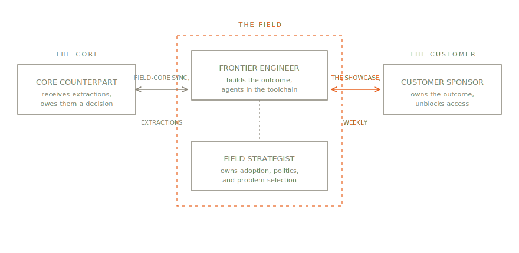

# 6. The Team

By week three at Granite Mutual, the numbers said the engagement was succeeding and the floor said otherwise. The summarization agent Adit had deployed — the platform's triage capability pointed at Granite's property claims — was reading files accurately and scoring well on the eval suite. Telemetry told the other story: of the sixty adjusters in the Columbus pilot group, nine had opened a summary that week. Adit did what engineers do with an adoption problem — treated it as a latency problem, then as a UI problem, and started rebuilding the panel.

Priya, the engagement's Field Strategist, did something else. She flew to Columbus and sat on the claims floor for two days, saying almost nothing. What she brought back was not a UI finding. The summaries lived in a separate tab, one click and a context switch away from the claim file where adjusters actually work — and one click, on a floor where people are graded on cycle time, is a veto. Underneath the click was fear with a rational basis. "If the summary misses a mold exclusion, it's my name on the file," one adjuster told her — Dee Alvarez, twenty-two years in, the person the floor actually listens to. The tool threatened the one thing adjusters own, their judgment on the file, and offered nothing they were measured on.

The turnaround took two weeks and very little engineering. The summary moved inline, onto the first screen of the claim file — platform configuration, two days, most of it drafted by Adit's agent while he reviewed. The real work was Priya's. She recruited Dee to co-review sixty summaries, and Dee's corrections went into the eval set, which put the floor's standard-bearer inside the tool instead of against it. Supervisors changed the morning standup script: start from the summary, verify the loss description and the coverage lines. By week six, forty-one of sixty adjusters were in the summaries daily, led by Dee, who had taken to correcting them in the margins like a teacher who has decided the student is worth the ink.

Adit tells the story shorter: the software worked in week three, the engagement started working in week five, and everything in between was somebody else's craft.

Ask an engineering leader to sketch a field team and you will usually get one box: the engineer, deployed. The record says that sketch is how engagements fail. The software gets built and nobody changes their Monday morning to use it; the extraction never reaches anyone with a roadmap; the customer's one indispensable executive was never in the room. Frontier's answer is four accountabilities — not four hires, four things that must each be someone's named job. Small teams put several on one person. What no team gets to do is leave one unowned, because an unowned accountability doesn't disappear; it just fails silently and sends the invoice later.

## The Frontier Engineer

The engineer is the role the discipline is named for, and one phrase in its definition carries most of the weight: the same technical bar as core product engineers.

The phrase is doing three jobs. It makes rotation possible — an engineer who couldn't pass the core team's bar can't rotate into it, and rotation is a structural rule, not a perk. It makes extraction credible — a platform team weighs a Ledger entry differently when its author could have built the feature themselves. And it protects the field from becoming the destination for engineers who didn't quite fit elsewhere, which is the quiet death of a field organization's standing and, shortly after, its funding. Palantir's version of the bar was blunt: Deltas passed the same hiring process as core engineers, and the profile was a scrappy startup CTO — someone who could design a system, wrangle hostile data, and hold a room.

The bar now has an AI-native layer. The systems Frontier teams deploy are mostly AI and agentic systems, and the toolchain they build with is agent-assisted, so the hiring test extends accordingly: can this person design an agentic system, construct an eval suite from a customer's real cases, and engineer context — and do they reach for machine leverage by reflex or under protest. An engineer who hand-builds what agents do better will blow the time-box; one who can't govern what their agents touch will blow something worse.

## The Field Strategist

This is the role everyone drops, and the dropping has a documented history. Palantir paired every Delta with an Echo — a Deployment Strategist, usually not an engineer, who owned problem selection, institutional politics, workflow reality, and adoption. Nearly every company that copied the FDE role copied the engineer and skipped the pair, on the reasonable-sounding theory that good engineers handle stakeholders. The theory fails on the arithmetic of attention: the engineer is heads-down in the build for most of every week, and terrain work done in the gaps is terrain work done badly.

The Field Strategist's craft is the substance of chapter 8's Terrain Map: who wins, who loses or thinks they lose, whose approval gates production, who operates the systems daily — and what each of them needs to see, at which Showcase. During the Loop they read the room the engineer can't watch while driving the demo. At Graduation they are the reason handoff lands on people prepared to receive it. None of this appears in a repo, which is why organizations that measure only commits conclude the role is optional. The measurable refutation is shelfware: software that runs and isn't used, the signature product of the one-box team.

## The Core Counterpart

Extraction — the leftward arrow of the whole diagram — fails without a named receiver, and it fails politely: everyone agrees generalization matters, the Ledger is dutifully kept, and every platform team's backlog is already full. A field function whose extractions arrive addressed to "the product organization" is mailing letters to an institution. The Core Counterpart is the named engineer or product manager who receives a specific engagement's Ledger and owes it a decision — generalize, defer, or discard, argued and recorded.

The accountability is deliberately light — a weekly Field-Core Sync during the engagement, an Extraction Review after — and deliberately personal. It also runs both directions: the Counterpart is the field team's line into what the platform is becoming, which is how engagements stay assembly-first instead of rebuilding last week's release from ignorance of it.

## The Customer Sponsor

The Sponsor is the one accountability Frontier does not staff, because it cannot: it belongs to the customer. The Sponsor owns the outcome on the customer's side, sits senior enough to unblock access and data, and attends Showcases. The Guide's line — no sponsor, no engagement — is a rule about starting, and it is meant literally. An engagement without a Sponsor has no one entitled to redirect it, no one to defend it at the customer's budget review, and no one whose Monday morning is committed to the outcome. It can still produce software. It cannot produce an outcome, because outcomes are things customers achieve, and someone on that side has to be achieving one.

Week one tests the Sponsor as much as the data. A Sponsor who can produce a warehouse login in two days is real; one who can't get you past the ticket queue is an org-chart decoration, and the Charter conversation should say so while saying so is still cheap.

## Practice: the Same-Bar Hire

*Evidence: proven — Palantir ran one hiring bar for Delta and Dev for a decade; the AI-native extension of the bar is the method's position, labeled promising.*

**Context.** You are staffing a field function, and the labor market offers a well-stocked aisle of solutions architects, sales engineers, and delivery consultants who look adjacent.

**Problem.** Hire below the core bar and the field function drifts, within a year, into a pre-sales support group: rotation stops (nowhere to rotate to), extraction credibility drops, and the product organization begins treating field requests as noise.

**Forces.** The adjacent hires are available now and interview smoothly — client polish reads well in a panel. The same-bar candidate is scarcer and often being courted by the core team too. And the field's compensation must match the bar, which finance will question until chapter 19's argument has been made.

**Solution.** One bar, administered by the same process that gates core engineering, plus the field-specific screens: an ambiguity test (a messy, underspecified problem with a customer in the loop), the AI-native layer (agentic design, eval construction, context engineering), and evidence of what one first-hand account called curious hustle — the reflex to get on the plane and find out. Reject candidates who pass the technical bar but treat the customer-facing half as beneath the work; that preference is the Field Strategist's accountability landing on someone who resents it.

**Consequences.** Hiring slows. Field headcount stays smaller than a services mindset would build, which is correct — machine leverage means the constraint is quality, not quantity. The return is a function that core engineering treats as peers, which is the precondition for everything in chapter 12.

## Practice: the Named Receiver

*Evidence: promising — synthesized from the documented failure (extraction withering into a suggestion box) and standard ownership discipline; field reports will move the label.*

**Context.** An engagement is being chartered. The product organization is busy, as it always is.

**Problem.** Extraction addressed to no one is extraction addressed to the backlog, where it composts.

**Forces.** Assigning a Counterpart costs a real engineer or PM real hours during an engagement they didn't ask for. Product leaders will offer a rotating duty or a triage alias instead, both of which reproduce the original failure with better tooling.

**Solution.** No Charter is signed without a named Core Counterpart on it, beside the Sponsor's name. The weekly Field-Core Sync and the post-engagement Extraction Review are theirs to attend; dispositions are theirs to argue and record. One person may serve several engagements; "the platform team" may serve none, because teams don't owe decisions — people do.

**Consequences.** Product management will feel taxed, and the tax is real — roughly two hours a week per engagement. The visible return arrives at the quarterly portfolio review, when recurring Ledger entries surface as a roadmap the product organization didn't have to guess at. A company unwilling to pay this tax has answered chapter 17's fit questions early: it wants the revenue of field engineering without the flywheel, which is a consultancy, and should be priced as one.

## Compression without deletion

Four accountabilities, and at most companies, fewer people. A seed-stage team runs an engagement with one engineer and a founder; the engineer holds the technical accountability and the founder is Sponsor-wrangler, Strategist, and Counterpart in one calendar. Frontier's requirement is not headcount — it is that the compression be explicit. Write the four names down, even when three of them are the same name. The exercise takes a minute and surfaces the standard omission immediately: the Counterpart, because at a small company "the product team" and "the field team" are the same six people, and everyone assumes shared context means shared decisions. It doesn't. The Ledger still needs a reader; the extraction still needs a decider; the flywheel still needs a hand on it.

The four accountabilities are the cast. The next chapter is the contract they all sign.
